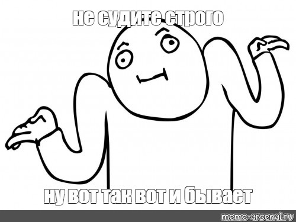

# module20_homework
## Практическая работа 20 модуля
### Что я изменила в задании этого модуля, по сравнению с 18...
1. Первым делом поменяла все иконки формата png на формат svg
p.s. Когда верстала страницу по заданию 18 модуля, я просто тупо перепутала форматы)))
2. Убрала дублирующие стили для некоторых классов, чем реализовала принцип DRY
3. Некоторые иконки разместила группой, вследствие чего убрала лишние элементы HTML-разметки, и ненужные стили CSS. Реализовала принцип KISS
4. По заданию не нужно было делать интерактивные элементы, поэтому checkbox заменила на иконку, продемонстрировав принцип YANGI
5. Для улучшения семантики исправила в checkbox тег span на тег p
6. Для более "чистого кода" заменила заглавные буквы в навигации на строчные, и прописала Upppercase для этих элементов в стилях
7. Сделала, чтобы клик на логотип переносил на главную страницу, правда в данном проекте это не очень заметно)
8. Переименовала классы в div в блоках header и footer в класс с одним названием (menu), т.к. эти блоки идентичны, вследствии этого сократился CSS-код. Реализовала принцип БЭМ
9. Чтобы продемонстрировать принципы SOLID взяла 5 задание из прошлого (19) модуля. Добавила дочерний класс, перепрописала в нём родительское свойство, добавила классу свои свойства, изменила метод. 
### Проверила валидацию HTML-разметки сервисом W3C. Проверка ошибок не выявила
### Использовала в VScode линтеры для проверки: ESLint и Prettier
### Все принципы поняла, надеюсь продемонстрировала их верно
### Ну и картинка))) Отражает мою невнимательность к форматам иконок в позапрошлом модуле)))

